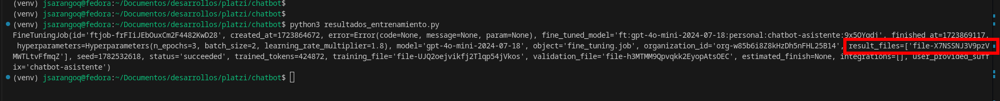

# Creación de un ChatBot con ChatGPT

## Requisitos
- Python 3.9 o superior
- VS Code
- Creación de la API-KEY de OpenAI

## Realizando fine-tuning a nuestros datos

> [!WARNING]
> Hacer fine-tuning puede implicar costos.

Cada dato de entrenamiento tiene la siguiente estructura:
- El role "system" le da la intrucción al modelo de cómo debe actuar. En este caso le está indicando que actúe como un asistente de atenciónn a clientes y estudiantes....
- El role "user": Simula la pregunta que haría el estudiante o usuario
- El role "asistant": Es la respuesta que daría el modelo a la pregunta ingresada
  
Tenemos al rededor de 1261 registros. Los datos para entrenamiento son similares a las siguientes líneas:


```
{
   "messages":[
      {
         "role":"system",
         "content":"Eres un asistente de atención a clientes y estudiantes de la plataforma de educación online en tecnología, inglés y liderazgo llamada Platzi"
      },
      {
         "role":"user",
         "content":"¿Cómo puedo mejorar mis habilidades en JavaScript?,"
      },
      {
         "role":"assistant",
         "content":"Para mejorar tus habilidades en JavaScript, te recomendamos tomar el Curso Práctico de JavaScript en https:\/\/platzi.com\/cursos\/javascript-practico\/. También puedes practicar en proyectos personales y buscar recursos en línea para continuar aprendiendo. ¡Mucho éxito en tu camino de aprendizaje de JavaScript!"
      }
   ]
}
```

> [!TIP]
> Para estructurar el promtp de pregunta, puedes usar historial o datos de tu empresa que más se ajuste a lo que pregunta el usuario

Tenemos 271 datos de validación. Los datos de validación nos servirán para evaluar las respuestas y la precisión. Estas tienen las siguientes características:

```
{
   "messages":[
      {
         "role":"system",
         "content":"Eres un asistente de atención a clientes y estudiantes de la plataforma de educación online en tecnología, inglés y liderazgo llamada Platzi"
      },
      {
         "role":"user",
         "content":"¿Cuáles son los pasos esenciales para comenzar un negocio?"
      },
      {
         "role":"assistant",
         "content":"Si quieres aprender los pasos esenciales para comenzar un negocio, te recomendamos el Curso para Comenzar tu Camino Emprendedor en https:\/\/platzi.com\/cursos\/camino-emprendedor\/. Además de esto, también puedes consultar nuestro catálogo de cursos relacionados con Emprendimiento, Marketing y Desarrollo de Negocios."
      }
   ]
}
```
En el [siguiente enlace]([https://](https://platform.openai.com/docs/guides/fine-tuning/preparing-your-dataset))  podemos ver los pasos para preparar nuestros datos para hacer fine-tuning.

## Preparación y análisis de los datos previo al fine-tuning

```
python3 validacion.py

```
El código anterior nos genera la siguiente salida:
```
Num examples: 1261
First example:
{'role': 'system', 'content': 'Eres un asistente de atención a clientes y estudiantes de la plataforma de educación online en tecnología, inglés y liderazgo llamada Platzi'}
{'role': 'user', 'content': '¿Cómo puedo mejorar mis habilidades en JavaScript?,'}
{'role': 'assistant', 'content': 'Para mejorar tus habilidades en JavaScript, te recomendamos tomar el Curso Práctico de JavaScript en https://platzi.com/cursos/javascript-practico/. También puedes practicar en proyectos personales y buscar recursos en línea para continuar aprendiendo. ¡Mucho éxito en tu camino de aprendizaje de JavaScript!'}
```

### Validación de formato
```
python3 validacion_formato.py
```
La ejecución del código anterior arroja el siguiente resultado:
```
No errors found
```
Si por alguna razón la ejecución arrojaría algún error, debemos corregirla de acuerdo a las indicaciones del [siguiente link]([https://](https://cookbook.openai.com/examples/chat_finetuning_data_prep))


## Conteo de tokens
```
python3 conteo_costos.py
```
La ejecución del script de conteo generará el siguiente resultado:
```
Num examples missing system message: 0
Num examples missing user message: 0

#### Distribution of num_messages_per_example:
min / max: 3, 3
mean / median: 3.0, 3.0
p5 / p95: 3.0, 3.0

#### Distribution of num_total_tokens_per_example:
min / max: 68, 206
mean / median: 133.87946074544013, 133.0
p5 / p95: 114.0, 159.0

#### Distribution of num_assistant_tokens_per_example:
min / max: 9, 132
mean / median: 69.51704996034893, 69.0
p5 / p95: 50.0, 92.0

1261 examples may be over the 16,385 token limit, they will be truncated during fine-tuning
```
Algunas interpretaciones:
- Num examples missing system message: 0 y Num examples missing user message: 0: Indican que no hay ningún dato de entrenamiento que le falte el rol system y user
- 0 examples may be over the 16,385 token limit, they will be truncated during fine-tuning: Indica que todos los datos tienen la longitud correcta y no exceden del límite de tokens permitidos. Si un mensaje sobrepasa este límite lo recomendable es hacer más corto el mensaje.


## Estimación de costos!!
```
Dataset has ~168822 tokens that will be charged for during training
By default, you'll train for 3 epochs on this dataset
By default, you'll be charged for ~506466 tokens
```

Podemos ver que el entrenamiento consumirá un aproximado 506 mil tokens. Con este valor podemos ir a la página de costos, sección Fine-tuning y estimar el costo resultante.
A agosto 2024, la página oficial de OpenAI indica que el fine-tuning para el modelo gpt-4o-mini-2024-07-18 es gratis hasta septiembre 2024.
En caso de que ya no sea gratis, el costo es de $3 por cada millón de tokens, entonces el costo aproximado sería de $1.5.

## Validación y estimación de costos para los datos de validación
```
python3 conteo_costos_validacion.py
```
- Número de tokens: ~109116
- Costo estimado: $0.318

## Entrenando nuestro modelo
1. Ingresar al [link](https://platform.openai.com/finetune) y seleccionar la opción fine-tuning y hacer clic sobre el botón crear
   
   
2. Subimos los datos de entrenamiento y de validación, asignamos un sufijo a nuestro modelo
   
   
3. Empieza el entrenamiento. Esto puede durar un par de horas
   
   
4. Listo. Nuestro modelo entrenado ha sido creado correctamente
   
   
> [!NOTE]
> Efectivamente, este entrenamiento no generó ningún costo!

## Validando nuestro modelo en el playgroud y desde python

1. Una vez finalizada, podemos realizar una primera validación a través del Playground de OpenAI de nuestro modelo entrenado. Para esto seleccionamos la opción de chat, en system ponemos la instrucción del role "system" de nuestro dato de entrenamiento y luego podemos hacer cualquier pregunta. Podemos probar cambiando los parámetros por ejemplo de temperatura para verificar si la respuesta es en base a los datos de entrenamiento.
   
   

2. De igual manera, podemos realizar la validación con código python. La respuesta debería ser similar.
   
```
python3 validacion_fine-tuning.py
```


## Obteniendo información del Fine-Tuning de nuestro modelo

Podemos obtener la información y los resultados del entrenamiento de nuestro modelo. Esta información es importante para analizar, guardar, hacer comparaciones a futuro.

```
python3 resultados_entrenamiento.py
```

Al obtener los resultados de entrenamiento, los datos están almacenados en el archivo del parámetro "result_files". Podemos acceder a este archivo para revisar a fondo los resultados del entrenamiento.



Al procesar los datos del archivo de fine tuning, podemos ver las siguientes imágenes

En términos de exactitud, podemos ver que en cada paso los resultados van aumentando hasta llegar a 0.9.


De igual forma, podemos ver que la pérdida va disminuyendo en cada paso, lo cual indica que el modelo funcionará con buen desempeño.


Para validar el modelo en la playground de OpenAI, se puede ajustar los parámetros como temperatura para obtener mejores resultados.

## Resumen de pasos de Fine-tuning
1. Formateo y validación de datos
2. Fine tuning
3. Evaluación
4. Optimizar parámetros en la validación

# Creación del bot en telegram:
1. Abrir la aplicación de telegram en web o app
2. Buscar @BotFather
3. Seguir los pasos indicados para crear el bot.
4. Puede agregar descripción, cambiar nombre usando los comandos:

```
 /setname
 /setdescription
 /setabouttext
 ```
5. Copiar el token del bot que luego será usado para interctuar con él

6. Integración del bot con nuestro modelo de OpenAI
 Esta integración se lo realiza en el archivo platzi_bot.py

## Pasos para ejecutar localmente
1. Crear un ambiente virtual
```
python -m venv venv
source venv/bin/activate
```

2. Copiar el archivo .env-example por .env y agregar los valores respectivos

```
OPENAI_API_KEY=
OPENAI_ID_MODELO=
OPENAI_MODEL_FINE_TUNING=

TELEGRAM_BOT_URL=https://api.telegram.org/bot
TELEGRAM_BOT_TOKEN=
```
3. Instalar las dependencias del proyecto:

```
pip install -r requirements.txt
```
4. En caso de requerir ejecutar los scripts de pruebas, validaciones, resultados, ejecutar cada uno de estos archivos de manera individual, ejm:
```
python resultados_entrenamiento.py
python validacion_fine-tuning.py
```

5. Ejecutar el archivo que realiza la integración con bot y nuestro model de OpenAI

```
python platzi_bot.py
```

## Probar el bot en línea
1. Abrir la aplicación telegram
2. Buscar el bot @julio_sarango_platzi_bot
3. Preguntar sobre algún conocimiento que desea adquirir. Ejm: "¿Qué curso debo segguir para aprender java?"
4. Obtendrá le respuesta en base al modelo entrenado


